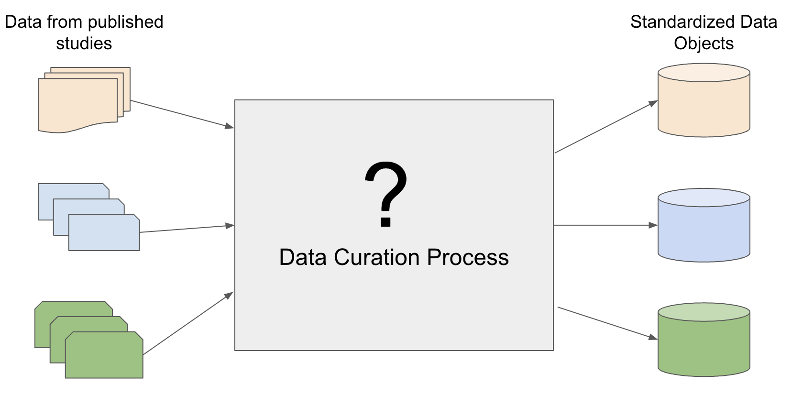
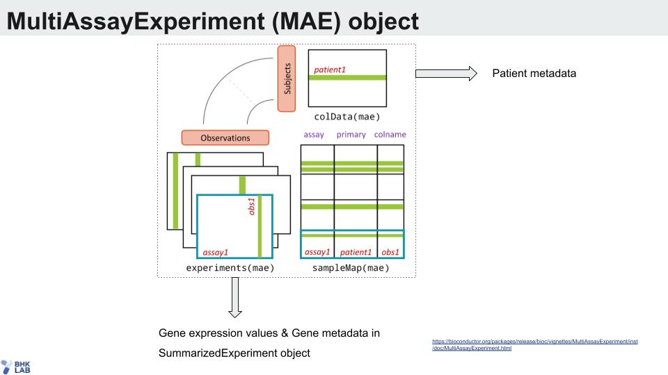

This RMarkdown script shows an example of ICB dataset curation workflow starting from curation to end analysis.\

## Introduction
### Data Curation Overview
We take data from published studies and curated them into standardized data objects to be used for integrated data analyses.
```{r echo=FALSE, out.width="50%"}

```

Standardized data curation resolves inconsistencies across different datasets:\

* Various data formats: txt, csv, tsv, Excel, GEO...
* Various identifiers: "patientid" = "patient-id" = "id" = "patient" = "unique_patient_id"
* Unfriendly format: Newline characters, spaces, other unconventional characters
* Multiple data parts: patient/sample metadata, multiple assay data (RNA-seq, SNV...)

The standardized data are integrated into MultiAssayExperiment object:\
\
```{r echo=FALSE}

```

MultiAssayExperiment offers:\

1. item 1
2. item 2
3. item 3
4. item 4

### Data Curation Process


### ORCESTRA: Transparent and Reproducible Data Curation Pipeline Platform


## Data Curation Example: VanDenEnde
The scripts uses ICB_VanDenEnde data curation pipeline as an example. The rest of the datasets follow the same workflow.\
The pipeline is available in: [ICB_VanDenEnde-snakemake](https://github.com/BHKLAB-DataProcessing/ICB_VanDenEnde-snakemake)\
There are common functions used across all ICB dataset curation pipelines which are available in [ICB_Common](https://github.com/BHKLAB-DataProcessing/ICB_Common)\
\
The script is organized in 4 steps:\

1. Downloads data from the publication source
2. Formats the downloaded data
3. Processes the formatted data into common data format across all ICB datasets
4. Creates MultiAssayExperiment object

```{r setup, include=FALSE}
knitr::opts_chunk$set(echo = TRUE)
```

```{r message=FALSE}
# library(data.table)
# library(GEOquery)
# library(Biobase)
# library(SummarizedExperiment)
# library(MultiAssayExperiment)
# library(GenomicRanges)
# library(biomaRt)
# library(stringr)
# library(readxl)
# library(tximport)
```

```{r VanDenEnde study}
# options(timeout=1000)
# 
# #' Before run, please add folder - Data and sub folders : download, annotation, processed, RDS and TSV 
# study <- 'VanDenEnde'
# download_dir <- '~/Data/download'
# annotation_dir <- '~/Data/annotation'
# processed_dir <- '~/Data/processed'
# rds_dir <- '~/Data/RDS'
# tsv_dir <- '~/Data/TSV'
```

### 1. Download Source and Annotation Data
Publication: [https://pubmed.ncbi.nlm.nih.gov/33504550/](https://pubmed.ncbi.nlm.nih.gov/33504550/)\
Data source: [https://www.ncbi.nlm.nih.gov/geo/query/acc.cgi?acc=GSE165252](https://www.ncbi.nlm.nih.gov/geo/query/acc.cgi?acc=GSE165252)

```{r VanDenEnde download data}

#' 1.1 Download source data
# download.file(
#   url='https://ftp.ncbi.nlm.nih.gov/geo/series/GSE165nnn/GSE165252/matrix/GSE165252_series_matrix.txt.gz',
#   destfile = file.path(download_dir, 'GSE165252_series_matrix.txt.gz')
# )
# download.file(
#   url='https://ftp.ncbi.nlm.nih.gov/geo/series/GSE165nnn/GSE165252/suppl/GSE165252_norm.cnt_PERFECT.txt.gz',
#   destfile = file.path(download_dir, 'GSE165252_norm.cnt_PERFECT.txt.gz')
# )
# 
# #' Download annotation files
# #' Gene annotation data is kept in https://github.com/BHKLAB-DataProcessing/Annotations
# #' Tissue and drug annotations for the ICB data are in https://github.com/BHKLAB-DataProcessing/ICB_Common/tree/main/data
# 
# #' 1.2 Download gene annotation data
# download.file(
#   url='https://github.com/BHKLAB-DataProcessing/Annotations/blob/master/Gencode.v19.annotation.RData?raw=true',
#   destfile = file.path(annotation_dir, 'Gencode.v19.annotation.RData')
# )
# 
# #' 1.3 Download tissue and drug annotation data
# download.file(
#   url='https://github.com/BHKLAB-DataProcessing/ICB_Common/raw/main/data/curation_drug.csv',
#   destfile = file.path(annotation_dir, 'curation_drug.csv')
# )
# download.file(
#   url='https://github.com/BHKLAB-DataProcessing/ICB_Common/raw/main/data/curation_tissue.csv',
#   destfile = file.path(annotation_dir, 'curation_tissue.csv')
# )
```


### 2. Format downloaded source data. 
This step extracts clinical and expression data from the source data format and parses them into more processing-friendly format.
```{r VanDenEnde format downloaded data}
# commandArgs <- function(trailingOnly = TRUE){ return(c(download_dir)) }
# source('https://raw.githubusercontent.com/BHKLAB-DataProcessing/ICB_VanDenEnde-snakemake/main/scripts/format_downloaded_data.R')
# #' In the end, it produced two files: CLIN.txt and EXPR.txt.gz
```


### 3. Process the formatted data to common data format across all ICB datasets
```{r VanDenEnde process the formatted data}
# commandArgs <- function(trailingOnly = TRUE){ return(c(download_dir, processed_dir, annotation_dir)) }
# source('https://raw.githubusercontent.com/BHKLAB-DataProcessing/ICB_VanDenEnde-snakemake/main/scripts/Format_Data.R')
# #' In the end, it produced three files: 
# #' CLIN.csv, 
# #' EXPR.csv and 
# #' cased_sequenced.csv, a file that indicates which patient has which molecular profiles. In this case, all patients will have EXPR data only.
```

### 4. Create MultiAssayExperiment object
```{r VanDenEnde create MultiAssayExp object}
# load(file.path(annotation_dir, "Gencode.v19.annotation.RData"))
# source("https://raw.githubusercontent.com/BHKLAB-DataProcessing/ICB_Common/main/code/get_MultiAssayExp.R")
# multi_assay_exp <- get_MultiAssayExp(study = study, input_dir = processed_dir)
```

Data object is uploaded to Zenodo and made avaialble on ORCESTRA platform.\
RDS objects are downloaded and converted into TSV files using rds_to_tsv.R.

### 5. Extract TSV files from the Data Object
```{r}
# assay_name <- 'expr'
# obj_name = paste0('ICB_', study)
# dir.create(file.path(tsv_dir, obj_name))
# 
# #' output the clinical metadata
# coldata <- data.frame(colData(multi_assay_exp))
# write.table(
#   coldata, 
#   file=file.path(tsv_dir, obj_name, paste0(obj_name, '_metadata', '.tsv')), 
#   sep='\t',
#   col.names=TRUE, 
#   row.names=TRUE
# )
# 
# #' output expr data and gene metadata
# experiment <- experiments(multi_assay_exp)[[assay_name]]
# assay <- data.frame(assay(experiment))
# assay_genes <- data.frame(rowRanges(experiment))
# write.table(
#   assay, 
#   file=file.path(tsv_dir, obj_name, paste0(obj_name, '_', assay_name, '.tsv')),  
#   sep='\t',
#   col.names=TRUE, 
#   row.names=TRUE
# )
# write.table(
#   assay_genes, 
#   file=file.path(tsv_dir, obj_name, paste0(obj_name, '_', assay_name, '_genes.tsv')),  
#   sep='\t',
#   col.names=TRUE, 
#   row.names=TRUE
# )
```
